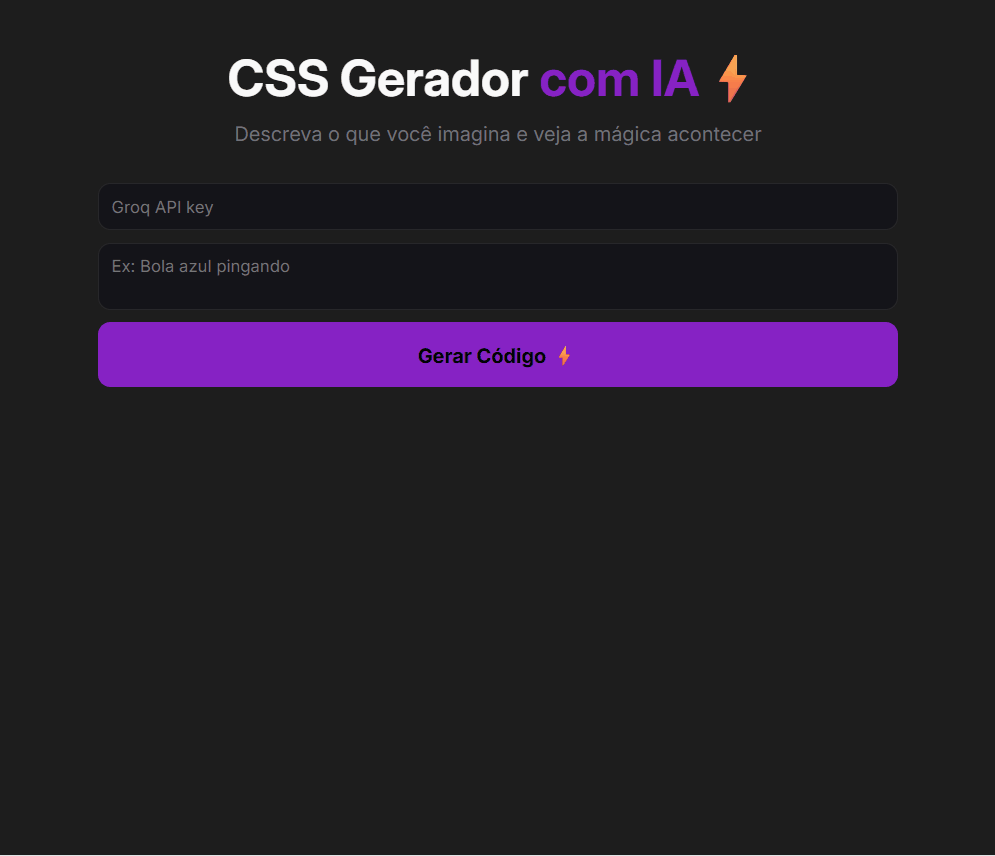

<div align="center">

<h1>
  ⚡ CSS Gerador com IA
</h1>

<p>
  Gera código HTML/CSS a partir de descrições em linguagem natural, usando um modelo de IA via API — digite "bola azul pingando" e veja o código (e o preview) aparecerem na hora.
</p>

<br />

<p>
  
  
</p>

<p>
  
  
  
  
</p>

<p>
  <a href="#-demonstração">Demo</a> •
  <a href="#-funcionalidades">Features</a> •
  <a href="#-tecnologias-utilizadas">Stack</a> •
  <a href="#-como-executar">Executar</a> •
  <a href="#-autora">Autora</a>
</p>

</div>

---

## 📸 Demonstração

<div align="center">
  
</div>

---

## 📋 Índice

- [Sobre o Projeto](#-sobre-o-projeto)
- [Funcionalidades](#-funcionalidades)
- [Tecnologias Utilizadas](#-tecnologias-utilizadas)
- [Estrutura do Projeto](#-estrutura-do-projeto)
- [Aprendizados](#-aprendizados)
- [Desafios Encontrados](#-desafios-encontrados)
- [Melhorias Futuras](#-melhorias-futuras)
- [Como Executar](#-como-executar)
- [Autora](#-autora)
- [Licença](#-licença)

---

## 🎯 Sobre o Projeto

O **CSS Gerador com IA** é uma ferramenta que traduz descrições em português — como "bola azul pingando" ou "quadrado girando" — em código HTML e CSS funcional, exibindo o resultado em tempo real através de um preview interativo.

O **objetivo principal** foi entender na prática como integrar uma aplicação front-end a uma API de linguagem natural (LLM), controlando o comportamento do modelo através de *prompt engineering* para garantir respostas previsíveis e utilizáveis diretamente como código — sem markdown, sem explicações, apenas HTML/CSS puro.

---

## ✨ Funcionalidades

- ✅ Gera HTML e CSS a partir de uma descrição em linguagem natural, usando o modelo `llama-3.3-70b-versatile` via Groq API
- ✅ Exibe o código gerado em uma caixa de resultado formatada
- ✅ Renderiza o preview do código gerado em tempo real dentro de um `<iframe>` isolado, via `srcdoc`
- ✅ Validação de campos obrigatórios (descrição e API key) com mensagens de erro específicas
- ✅ Feedback visual de carregamento enquanto a IA processa a requisição
- ✅ Tratamento de erros de rede e de resposta da API, com mensagens amigáveis ao usuário
- 📋 Botão para copiar o código gerado
- 📋 Histórico das últimas gerações

---

## 🛠️ Tecnologias Utilizadas

### Front-End

| Tecnologia | Finalidade |
|---|---|
| HTML5 Semântico | Estrutura da página e do preview isolado via `<iframe>` |
| CSS3 | Estilização em tema escuro, layout flexível com `flexbox` |
| JavaScript ES6+ | Manipulação do DOM, requisições assíncronas e tratamento de erros |
| Google Fonts (Inter) | Tipografia |

### Integração com IA

| Serviço | Finalidade |
|---|---|
| Groq API | Inferência de linguagem natural para geração de código |
| Modelo `llama-3.3-70b-versatile` | Interpretação da descrição do usuário e geração do HTML/CSS |

### Ferramentas & Workflow

| Ferramenta | Finalidade |
|---|---|
| Git & GitHub | Versionamento e hospedagem |
| VS Code | Editor de código |
| GitHub Pages | Deploy e hospedagem |

---

## 📁 Estrutura do Projeto

```
css-gerador-ia/
│
├── 📂 assets/images/
│   └── css-gerador-ia.gif      # Demonstração animada
│
├── 📂 src/
│   ├── styles.css              # Estilos globais (tema escuro)
│   └── scripts.js              # Lógica de integração com a API e DOM
│
├── index.html                  # Ponto de entrada
└── README.md
```

---

## 📚 Aprendizados

Trabalhar neste projeto aprofundou meu entendimento sobre:

- **Prompt engineering aplicado** — como escrever uma *system message* restritiva o suficiente para que o modelo retorne apenas código puro, sem crases nem explicações, tornando a resposta diretamente utilizável pela aplicação.
- **Requisições assíncronas com `fetch` e `async/await`** — como estruturar chamadas a uma API externa com autenticação via header `Authorization: Bearer`, tratando tanto sucesso quanto falha de forma previsível.
- **Isolamento de conteúdo dinâmico com `iframe.srcdoc`** — como renderizar HTML/CSS gerado dinamicamente em um ambiente isolado do documento principal, evitando que estilos ou scripts do código gerado interfiram na aplicação.
- **UX em fluxos de IA generativa** — a importância de comunicar estado de carregamento e erros de forma clara, já que a resposta da IA não é instantânea nem sempre previsível.

> 💡 *Principal aprendizado: a qualidade da resposta de um modelo de IA depende diretamente da precisão das instruções dadas a ele — o prompt é, na prática, parte da lógica da aplicação.*

---

## 🧩 Desafios Encontrados

### 🔴 Desafio 1: Respostas da IA vinham formatadas com markdown

**Problema:** o modelo frequentemente retornava o código envolto em blocos de crases (` ```html `), o que quebrava a renderização direta no `iframe` e poluía a caixa de código.

**Solução:** ajustei a *system message* para instruir explicitamente o modelo a nunca usar crases ou markdown, especificando o formato exato esperado (CSS dentro de `<style>` seguido do HTML). Isso eliminou a necessidade de tratar a resposta com regex no front-end.

---

### 🔴 Desafio 2: Renderizar código gerado dinamicamente sem comprometer a página principal

**Problema:** inserir o HTML/CSS gerado diretamente no DOM da página poderia sobrescrever estilos existentes ou causar comportamentos inesperados.

**Solução:** utilizei um `<iframe>` com a propriedade `srcdoc`, que recebe uma string de HTML e a renderiza como um documento completamente novo e independente, dentro do próprio `<iframe>`.

Na prática, isso significa que:
- O CSS gerado pela IA (incluindo `@keyframes`, seletores genéricos como `body` ou `*`, etc.) fica restrito ao documento interno do `iframe` e **não vaza** para a página principal.
- O HTML gerado tem seu próprio `document`, então não há risco de duplicar IDs, sobrescrever elementos existentes ou quebrar a estrutura da aplicação.
- Cada nova geração basta atualizar `codeResult.srcdoc = result`, e o navegador recria o documento interno do zero — não é preciso limpar manualmente estilos ou elementos da geração anterior.

Foi essa isolação nativa do `iframe` (um "documento dentro do documento") que resolveu o problema, sem precisar de nenhuma lógica extra de sandbox ou limpeza manual do DOM.

---

### 🔴 Desafio 3: Feedback de estado durante a espera da resposta da IA

**Problema:** como a geração de código pela IA leva alguns segundos, a interface ficava sem resposta visual, dando a impressão de que o botão não havia funcionado.

**Solução:** implementei atualização imediata da caixa de resultado com uma mensagem de carregamento ("Gerando código com IA...") assim que a requisição é disparada, e limpei o preview anterior antes de aguardar a nova resposta.

---

## 🔮 Melhorias Futuras

- [ ] **Botão de copiar código** — *facilitar o reaproveitamento do código gerado sem seleção manual*
- [ ] **Histórico de gerações** — *permitir revisitar descrições e resultados anteriores na mesma sessão*
- [ ] **Ocultar a API key digitada** — *usar `type="password"` no campo, evitando exposição visual da chave*
- [ ] **Tratamento de rate limit da API** — *exibir mensagem específica quando o limite de requisições da Groq for atingido*
- [ ] **Suporte a mais frameworks CSS** — *permitir gerar código já adaptado a Tailwind, por exemplo*

---

## ⚙️ Como Executar

### Pré-requisitos

- Navegador moderno (Chrome 90+, Firefox 88+, Edge 90+)
- Uma API key gratuita da [Groq](https://console.groq.com/)

### Instalação e Execução

```bash
# 1. Clone o repositório
git clone https://github.com/aline-mmiranda/css-gerador-ia.git

# 2. Acesse a pasta do projeto
cd css-gerador-ia

# 3. Abra diretamente no navegador:
open index.html

# Ou use um servidor local para evitar erros de CORS:
npx live-server
```

> ⚠️ **Aviso de segurança:** este é um projeto de estudo. A API key é inserida diretamente na interface e usada apenas no navegador do usuário — nenhuma chave é armazenada ou enviada a terceiros pela aplicação. Ainda assim, expor uma chave de API diretamente no front-end **não é uma prática recomendada para produção**, pois ela fica visível a qualquer pessoa que inspecione o código do navegador. Em uma aplicação real, essa requisição deveria passar por um back-end (proxy), que guardaria a chave em variável de ambiente e nunca a exporia ao cliente. Use apenas chaves gratuitas/de teste ao rodar este projeto.

---

## 🚀 Deploy

<div align="center">

  [](https://aline-mmiranda.github.io/css-gerador-ia/)

  Hospedado em: **GitHub Pages**

</div>

---

## 👩‍💻 Autora

<div align="center">

  **Aline M Miranda**
  <br />
  <em>Desenvolvedora Front-End</em>

  <br />
  <br />

  [](https://linkedin.com/in/aline-mmiranda)
  [](https://github.com/aline-mmiranda)

</div>

---

<div align="center">
  <sub>
    Feito com ❤️ por
    <a href="https://github.com/aline-mmiranda">Aline M Miranda</a>
  </sub>
</div>
